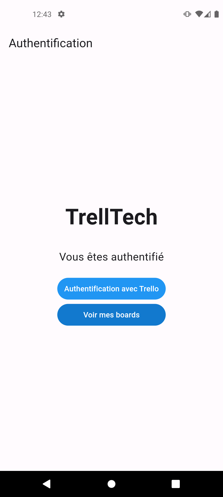
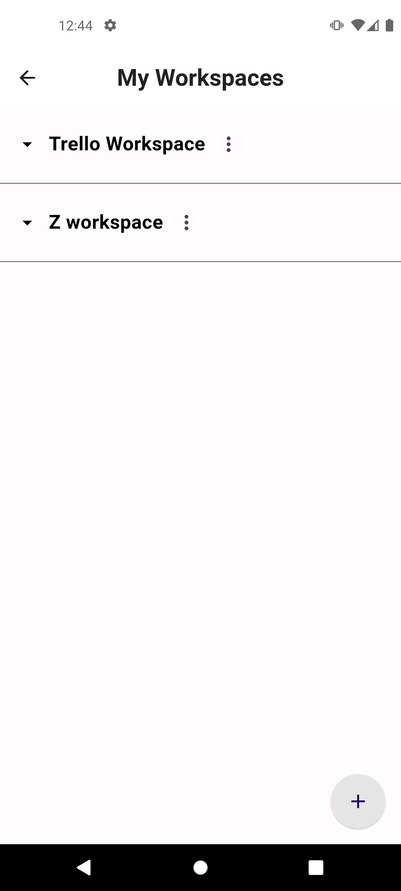
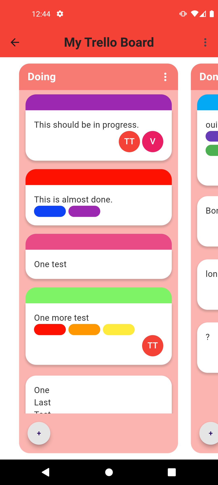
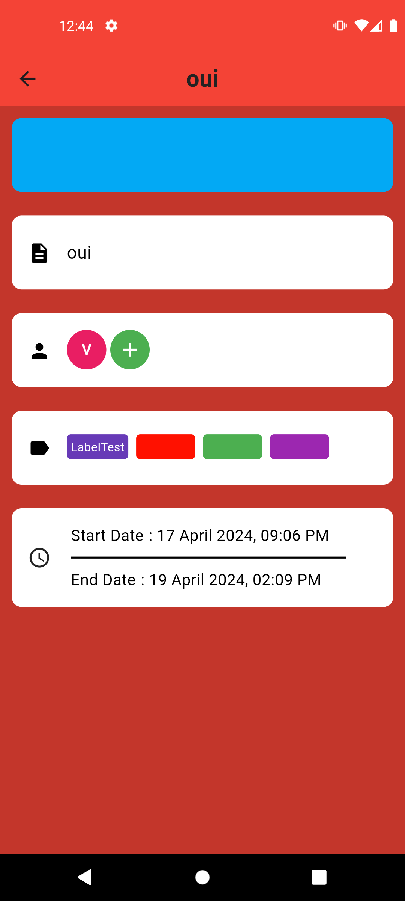
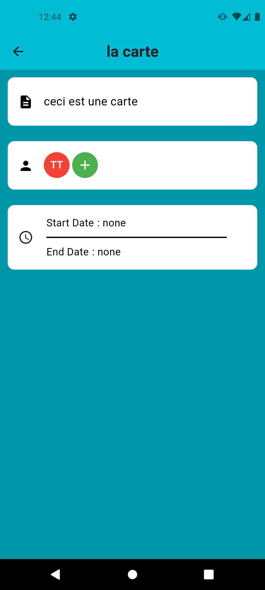

# TrellTech (T-DEV-600)

## Introduction 📖
The aim of this project is to create an client side application of the Trello board. The application will be able to create, edit and delete boards, lists and cards. The application will also be able to move cards between lists and boards.

## Screenshots 📸

Solarized dark             |  Solarized Ocean
:-------------------------:|:-------------------------:
{width=60%} |  {width=60%}
{width=60%} |  {width=60%}
{width=60%} |  {width=60%}


## Technologies 💯

- Flutter : **[Flutter](https://flutter.dev/)**

## Steps to install 📝

- **Clone repository :**

    ```bash
    git clone git@github.com:EpitechMscProPromo2026/T-DEV-600-TLS_12.git
    ```

- **Install Flutter for windows :**

    Download the Flutter SDK
    **[Flutter SDK](https://storage.googleapis.com/flutter_infra_release/releases/stable/windows/flutter_windows_3.19.5-stable.zip)**

    Then add it to your environment variables.
    To do it, go in the environment variables then in the user variables for (your username), look for the path entry, click on edit environment variable, double click in an empty row, then type
    
    ```bash
    %USERPROFILE%\dev\flutter\bin.
    ```

    <br>

- **Install Android Studio for windows :**

    Download Android Studio
    **ANDROID STUDIO** : **[Android Studio](https://developer.android.com/studio)**
    Then go to settings dialog and SDK Manager,
    - Click **more options** icon
    - Click **Device Manager** from the dropdown menu
    - Click virtual
    - Click Create Device
    - Select a phone and click next, then click one system image, then click next, then click finish

    <br>
    Agree to android licences

    ```bash
    flutter doctor --android-licenses
    ```

    <br>

- **Check the installations :**

    Type this command in the root project directory :

    ```bash
    flutter doctor
    ```

    This command will check if you have all the necessary tools to run the application. Like if you have the android emulator or the ios simulator installed on your machine or if you have a physical device connected to your machine.
    If not, you need to install the flutter and dart plugins in your IDE.
    <br>

- **Run Application :**

    ```bash
    flutter run
    ```

- **Build Application:**

    ```bash
     flutter build appbundle
    ```

    This command will build the application in the build folder of the project.

## Contributors 💪

**- Nathan DULAC** <br>

- [Github](https://github.com/Torahime3)
- [Linkedin](https://www.linkedin.com/in/nathan-dulac-2aa654257/)<br>

**- Valerian Alamar** <br>

- [Github](https://github.com/Valamar12)
- [Linkedin](https://www.linkedin.com/in/valerian-a-43171328a/)<br>

**- Scott Fitzgerald** <br>

- [Github](https://github.com/scottfzd)
- [Linkedin](https://www.linkedin.com/in/nigelfitzgerald/)<br>
